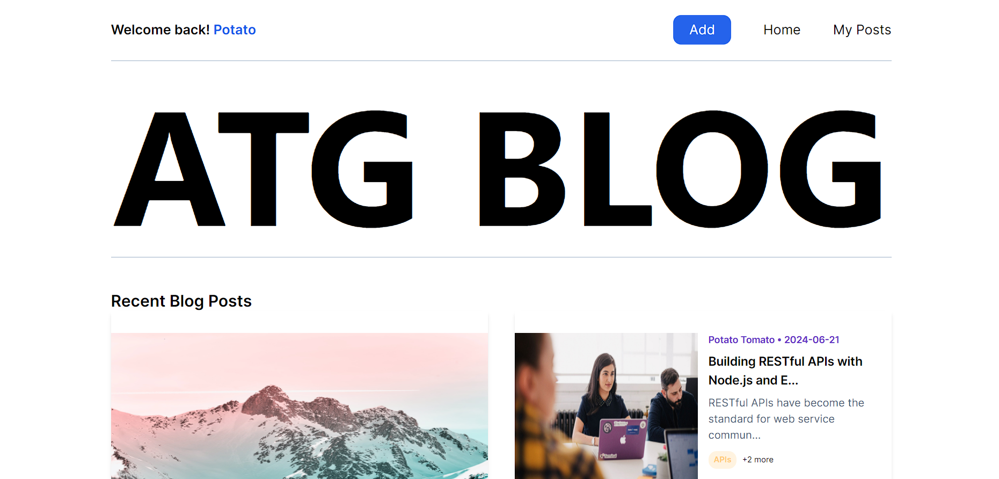
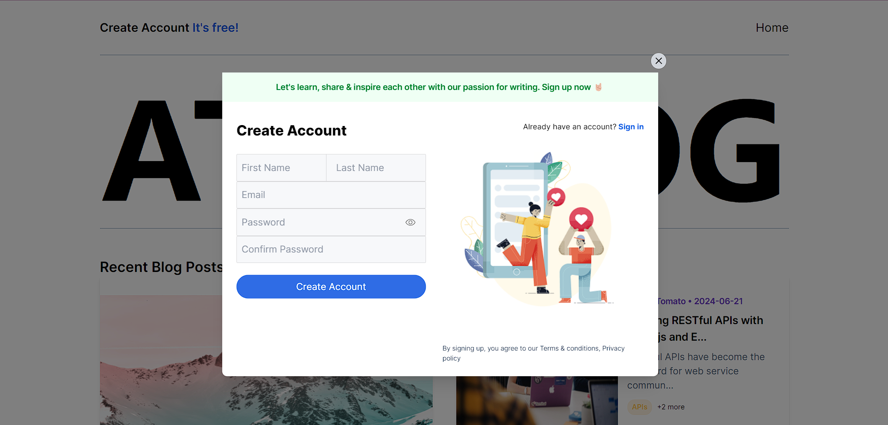
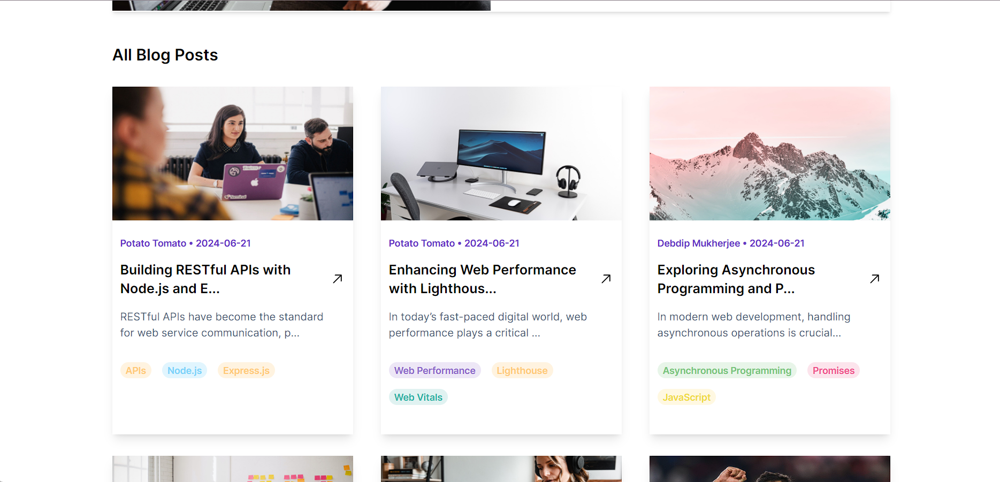

# ATG Blog: Your Ultimate Blogging Platform

Welcome to **ATG Blog**, a dynamic and interactive platform built with the powerful MERN stack (MongoDB, Express.js, React.js, and Node.js). ATG Blog is designed to offer a seamless and engaging blogging experience for both readers and writers alike.

## Key Features:

- **Read and Explore Blogs:** Dive into a diverse collection of blogs on various topics. From tech trends to personal stories, our platform offers something for everyone.

- **Write and Share:** Have a story to tell or insights to share? ATG Blog provides an easy-to-use interface for you to create, edit, and publish your blogs.

- **Like and Comment:** Engage with the community by liking and commenting on blogs. Share your thoughts and connect with fellow readers and writers.

- **User Authentication:** Enjoy a secure and personalized experience with our comprehensive authentication features. Register, log in, and manage your profile with ease.

Join ATG Blog today and become part of a vibrant community where ideas flow freely and creativity knows no bounds. Whether you are here to read, write, or connect, ATG Blog is your go-to platform for all things blogging.

## Tech Stack

**Client:** React, Tailwind CSS, Axios, React-Router, React-Icons

**Server:** Node.js, Express.js, MongoDB, Mongoose, JWT, Multer, MailerSend
## Demo

https://visuals-dashboard.vercel.app/

## Installation

Install ATG Blog with npm

```bash
  https://github.com/DebdipWritesCode/ATGBlog.git
```

Frontend

```bash
  cd Frontend
  npm install
  npm run dev
```
Backend

```bash
  cd Backend
  npm install
  cd api
  node index.js
```
## Screenshots





